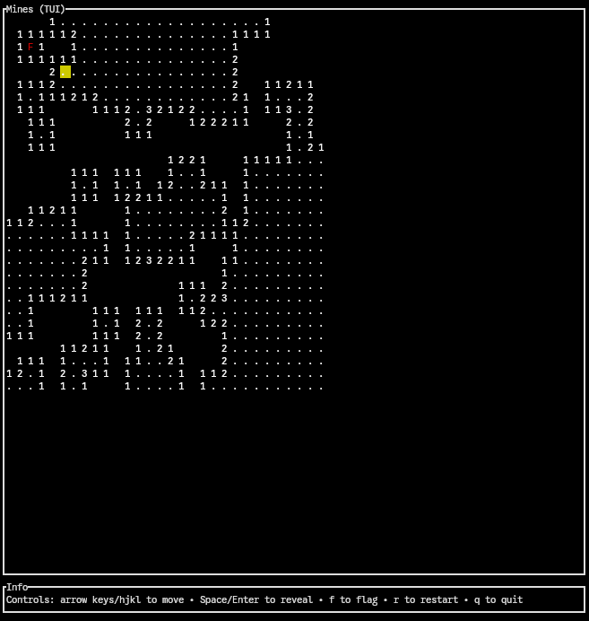

# Minesweeper
This is a simple minesweeper game written in Rust.

It can be played in the terminal as a CLI, as a TUI or as a GUI inside a web browser.

## Installation
You can use this tool by compiling it from source. You can also download a pre-built binary from the [releases page](https://github.com/arnaudelrio/minesweeper/releases).

It is also published at [crates.io](https://crates.io/crates/minesweeper_ctg), and you can install it via:
```bash
cargo install minesweeper_ctg
```

## CLI
To play the game in the terminal, run the following command:
```
cargo run -- cli <args>
```

The CLI version supports the following arguments:
- `rows cols`: Play the game with the specified number of rows and columns, and 10% of mines.
- `rows cols mines`: Play the game with the specified number of rows and columns, and the specified number of mines.
- `rows cols x1,y1 x2,y2 ...`: Play the game with the specified number of rows and columns, and the specified number of mines at the specified coordinates.

## TUI
To play the game in a terminal user interface, run the following command:
```
cargo run -- tui
```

The TUI version also supports the arguments detailed in the CLI version.



## GUI
The GUI is built using the Yew framework. Therefore, it is recommended to use the `trunk` tool to build and run the GUI.

To play the game in a graphical user interface, run the following command:
```
trunk serve
```
